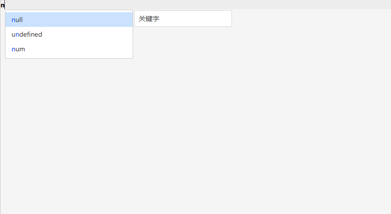

在线体验：[code-editor (gitee.io)](http://hp-future.gitee.io/code-editor/)


# 关键字

```
如果
否则
则
并且
或者
null
undefined
```

# 运算符

```
+
-
*
/

>
>=
<
<=
==
!=
```

# 标点符号

```
;
,
```

# 边界符

```
()
{}
[]
```

# 全局变量智能提示（如下图）



# 配置选项

```typescript
interface EditorOptionType = {
    /**
     * 初始化代码
     */
    code?: string;
    /**
     * 全局变量
     * @default []
     */
    vars: GlobalVars[];
}
```